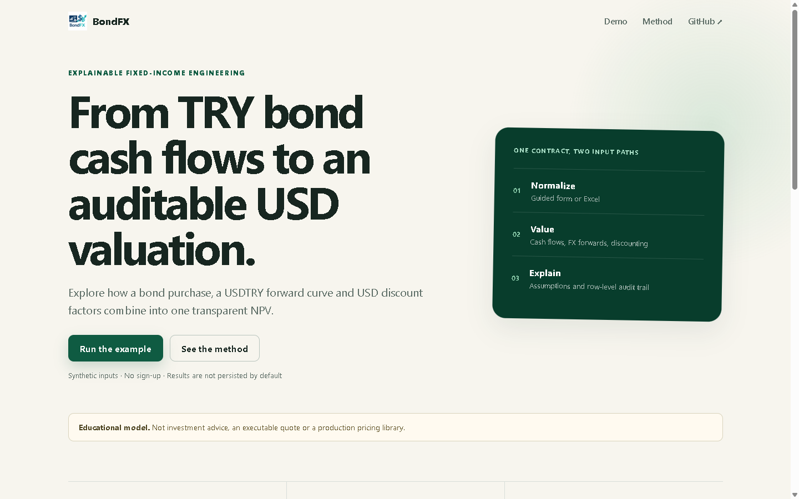

# BondFX

BondFX is an educational proof of concept that estimates the USD present value
of a TRY-denominated bond whose future cash flows are converted through a
USDTRY forward curve.

It is designed as a transparent, reproducible finance-engineering demo:

- **input:** guided values or three synthetic Excel workbooks;
- **output:** invested TRY notional, hedged USD cash flows, USD present value
  and NPV versus the initial USD budget;
- **audience:** finance engineers, quantitative developers and product teams
  exploring explainable valuation workflows.

> **Educational use only.** BondFX is not investment advice, a trading system,
> an executable market quote or a production pricing library.

## Why this project exists

Cross-currency bond analysis is often spread across workbooks and manual steps.
BondFX demonstrates how the workflow can be made explicit and repeatable:

1. normalize manual or Excel inputs to one JSON contract;
2. validate every request;
3. generate the bond cash-flow schedule;
4. convert TRY cash flows with selected USDTRY forward rates;
5. discount the resulting USD cash flows;
6. expose the assumptions and a cash-flow-level audit trail.

## Try it

The fastest path is Docker:

~~~powershell
git clone https://github.com/Laimon99/tool-bond.git
cd tool-bond
docker compose up --build
~~~

Then open:

- Web app: http://localhost:3000
- API documentation: http://localhost:8000/docs
- Health check: http://localhost:8000/health

The app starts with a complete synthetic scenario. Select **Run the example** to
calculate it immediately.

### Try the Excel flow

Download or select these three committed synthetic files together:

- [Curve_swap.xlsx](examples/demo-data/Curve_swap.xlsx)
- [bond_storico.xlsx](examples/demo-data/bond_storico.xlsx)
- [Bond_tURCO.xlsx](examples/demo-data/Bond_tURCO.xlsx)

The files contain no client data, proprietary data or live market observations.

## Independently checkable example

[verified-example.xlsx](examples/demo-data/verified-example.xlsx) derives a
one-period zero-coupon case using visible spreadsheet formulas:

~~~text
TRY notional = 100,000 USD × 40 USDTRY = 4,000,000 TRY
PV USD       = 4,000,000 TRY ÷ 50 forward ask × 0.95 DF = 76,000 USD
NPV USD      = 76,000 − 100,000 = −24,000 USD
~~~

The same example is asserted independently in the Python test suite.
See [Validation](docs/VALIDATION.md) for the complete evidence chain.

## Model conventions

The current public contract deliberately supports a narrow scope:

- USDTRY means TRY per USD;
- the default conversion side is ask, representing the conservative rate
  used when buying USD with TRY;
- supported coupon frequencies are annual, semi-annual and quarterly;
- day count is ACT/365 Fixed;
- discount factors are interpolated log-linearly;
- FX forwards support linear or log-linear interpolation;
- curve endpoints are held flat and generate an explicit warning;
- NPV is defined as hedged USD cash-flow PV minus the initial USD budget.

Every successful API response includes these conventions in
result.model_assumptions.

Read [Model limitations](docs/MODEL_LIMITATIONS.md) before interpreting results.

## Architecture

~~~text
Next.js UI
    │
    ▼
FastAPI validation and orchestration
    │
    ├── Excel normalization
    ├── JSON Schema contracts
    └── persistence adapter (memory by default)
            │
            ▼
Python quantitative engine
~~~

The same request contract is used by manual input and Excel import. See
[Architecture](docs/ARCHITECTURE.md) and
[Run valuation contract](contracts/RUN_VALUATION_CONTRACT.md).

## Local development

### API

~~~powershell
cd apps/api
python -m venv .venv
.venv\Scripts\Activate.ps1
pip install -r requirements.txt
$env:PERSISTENCE_BACKEND="memory"
python -m uvicorn app.main:app --reload --port 8000
~~~

### Web

Node.js 22.12 or newer is recommended.

~~~powershell
cd apps/web
npm ci
$env:NEXT_PUBLIC_API_BASE_URL="http://localhost:8000"
npm run dev
~~~

### Quality gates

~~~powershell
cd apps/api
.venv\Scripts\python.exe -m unittest discover -s tests -v

cd ../web
npm run typecheck
npm run build

cd ../..
docker compose config --quiet
~~~

CI runs the same public test suite from a clean checkout.

## Repository map

~~~text
apps/
  api/             FastAPI service and tests
  web/             Next.js public demo
  desktop/         optional Electron wrapper
contracts/         versioned request/response JSON Schemas
examples/          synthetic demo and validation workbooks
services/
  quant-engine/    framework-independent valuation core
docs/              architecture, validation and model scope
~~~

## Privacy and security

- Real/client source files under data/ are ignored.
- Runtime artifacts, uploaded data and local runs are ignored.
- The default Docker profile uses in-memory persistence.
- Do not submit confidential workbooks in issues or pull requests.

See [Security policy](SECURITY.md).

## Project status

BondFX is a complete public PoC, not a production valuation platform. Planned
extensions are tracked in [ROADMAP.md](ROADMAP.md). Maintainers can use the
[public-release settings](docs/PUBLIC_RELEASE.md) and
[release checklist](RELEASE_BASELINE_CHECKLIST.md) before changing repository
visibility.

## License

Released under the [MIT License](LICENSE).
